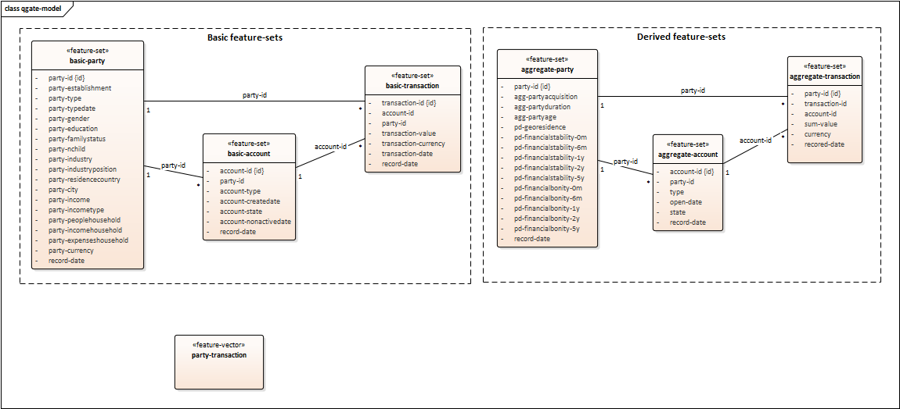

# QGate-Model
The sample machine learning (feature store) model, part of the quality gateway concept. 
This model is independent of machine learning solutions (definition in json, data in csv).

It can be used with various of ML/MLOps solutions with or without FeatureStore concept.

## Usage
The model is suitable for:
 - compare capabilities and functions of machine learning solutions (as part of RFP/X and SWOT analysis)
 - independent test new versions of machine learning solutions (with aim to keep quality in time)
 - unit, sanity, smoke, system, reqression, function, acceptance, performance, shadow, ... tests
 - external test coverage (in case, that internal test coverage is not available or weak)
 - etc.

## Structure
The solution contains this simple structure:
 - **00-high-level**
   - The high-level [view](./00-high-level/qgate-model.png) to the model for better understanding of logical relations
 - **01-model**
   - The definition of 01-projects, 02-feature sets, 03-feature vectors, etc. in JSON format
 - **02-data**
   - The data for model in CSV format for party, account, transaction, etc.

Addition detail, [see](./docs/README.md)

## Model

