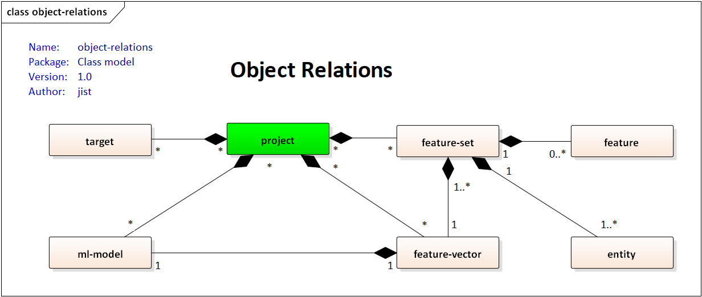

# Rules for generated data

This is a basic look at several roles (not completed list) applied to generated data. 
You can see the full detail in source code, see the folder `generator` in this GIT project.

## Name convention

 - Not to use '-' in feature/entity names (instead of that use '_')
   - Note: '_' supports compatibility between Python and SQL
 - Not to use longer name (for feature/entity name) than 32 chars, code_page=ASCII

## Object relations & packages

The object relations for key objects in meta-model, plus
splitting these objects in packages (01-model/01-project, 01-model/02-feature-set,
02-data, etc.).

## Supported types

TBD.

## 01. basic_party

 - **party_establishment**: between generated data minus 15-100 years
 - **party_nchild**: interval 0-4
 - **party_type**: available values 'lead', 'prospect', 'client'
 - **party_peoplehousehold**: respect amount of childrens

## 02. basic_contact

 - **cardinality**: basic_party vs basic_contact (1:N)
 - ...

## 03. basic_relation
 
 - **cardinality**: basic_party vs basic_relation (M:N)
 - ...

## 04. basic_account

 - **cardinality**: basic_party vs basic_account (1:N) 
 - **party_type**: only type 'client' has accounts (amount of accounts from 1 to 4)

## 05. basic_transaction

 - **cardinality**: basic_account vs basic_transaction (1:N) 
 - ...

## 06. basic_event

 - **cardinality**: basic_party vs basic_event (1:N) 
 - ...

## 07. basic_communication
 
 - **cardinality**: basic_party vs basic_event (1:N) 
 - ...
